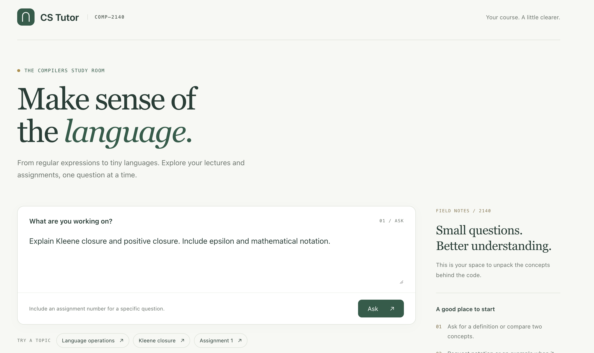
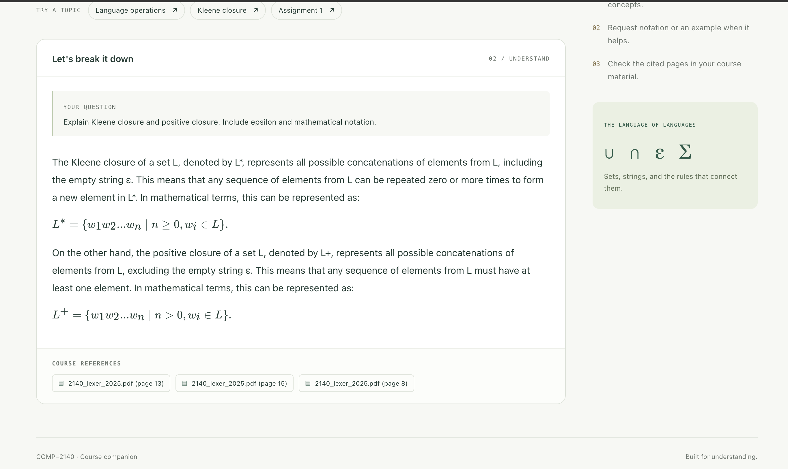
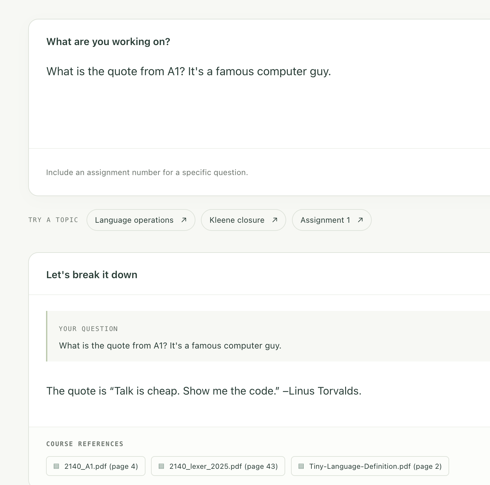
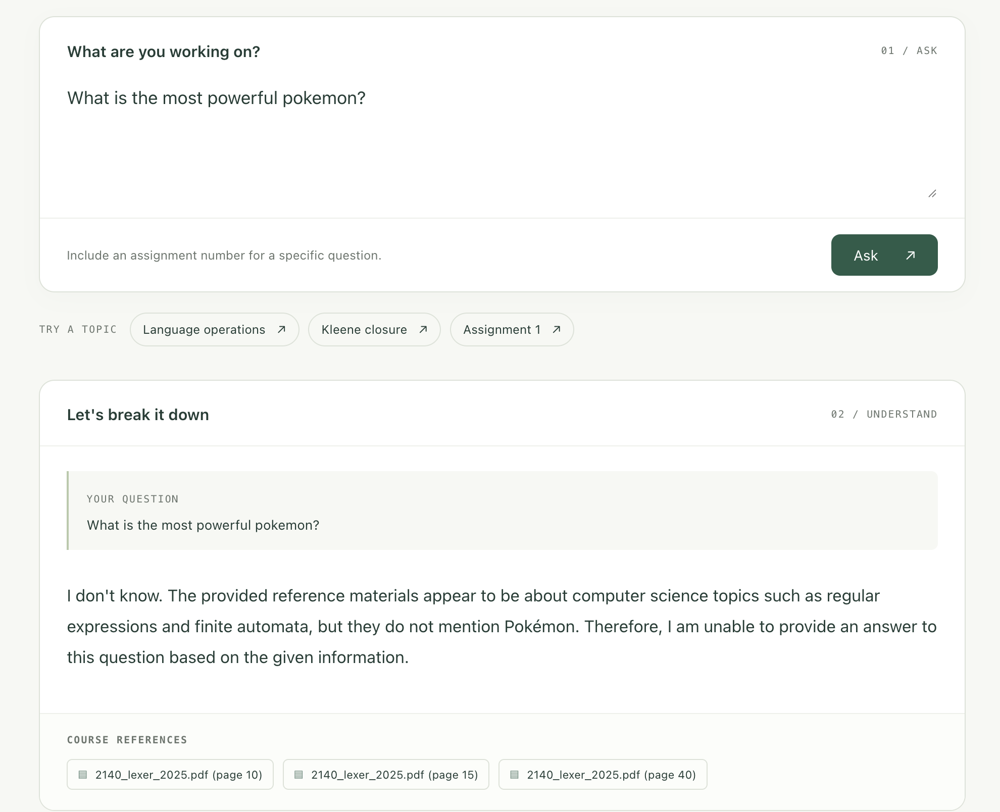
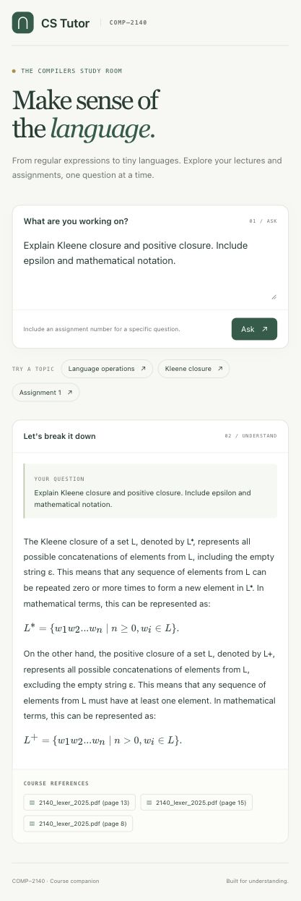

# CS Tutor Bot – RAG-based Course Assistant (COMP-2140)

A full-stack **Retrieval-Augmented Generation (RAG)** chatbot designed to help students understand course material for **COMP-2140 (Compilers)** without revealing full solutions.

The system uses **course assignment PDFs as ground truth**, retrieves relevant sections using embeddings + FAISS, and generates **grounded, non-hallucinating explanations** using a LLaMA-based language model.

---

## ✨ Features

- 📄 Ingests and indexes all COMP-2140 assignment PDFs (A1–A5)
- 🔎 Semantic search using **MiniLM embeddings + FAISS**
- 🧠 Grounded answers using **LLaMA (via Hugging Face Inference Endpoint)**
- 🚫 Prevents hallucinations and solution leakage
- 🧩 Full-stack architecture:
  - **Backend:** FastAPI (Python)
  - **Frontend:** React + TypeScript
- 📎 Source-aware responses (assignment-specific grounding)

---

## 🏗️ System Architecture

```bash
PDF Assignments (A1–A5)
↓
Text Chunking
↓
Sentence Embeddings (MiniLM)
↓
FAISS Vector Index
↓
Relevant Context Retrieval
↓
Grounded Prompt Construction
↓
LLaMA Chat Completion
↓
Student-Facing Response (React UI)

---
```
## 📂 Project Structure
```bash
cs-tutor-bot/
├── backend/
│ ├── main.py # FastAPI app & API routes
│ ├── rag.py # PDF loading, chunking, FAISS retrieval
│ ├── llm.py # Hugging Face LLaMA API client
│ ├── prompts.py # Strict RAG prompt construction
│ └── test_rag_*.py # RAG verification scripts
│
├── frontend/
│ ├── src/
│ │ ├── App.tsx # React UI
│ │ └── index.tsx
│ └── index.css
│
├── data/
│ └── compilers/
│ ├── 2140_A1.pdf
│ ├── 2140_A2.pdf
│ ├── 2140_A3.pdf
│ ├── 2140_A4.pdf
│ └── 2140_A5.pdf
│
├── requirements.txt
└── README.md


---
```
## 🚀 Setup Instructions

### 1️⃣ Backend Setup

Create and activate a virtual environment:

```bash
python -m venv venv
source venv/bin/activate

pip install -r requirements.txt

export HF_ENDPOINT=https://<your-endpoint>.aws.endpoints.huggingface.cloud
export HF_TOKEN=hf_XXXXXXXXXXXXXXXX

Start the backend:

uvicorn backend.main:app --reload


Backend runs at:
👉 http://127.0.0.1:8000


2️⃣ Frontend Setup
cd frontend
npm install
npm start


Frontend runs at:
👉 http://localhost:3000


```
## Screenshots:






## Mathematical notation

The PDF pipeline preserves Unicode operators, numbered items, and line breaks.
Legacy Symbol-font operators are repaired only in text from that font (for example,
the union glyph in `2140_lexer_2025.pdf`, PDF page 8). Each chunk retains its PDF
page number, which appears beside the retrieved source in answers. Put lecture and
assignment PDFs in `data/compilers/`; restart the backend after changing documents
to rebuild the index.

Answers support `$A \cap B$` inline math and display formulas delimited by `$$`
on separate lines, using remark-math and KaTeX. Unicode `∩` and `∪` also display
directly. The prompt asks the model to use these delimiters and preserve notation.
Image-only pages and other broken font encodings still require OCR or manual
source repair; the pipeline does not guess missing symbols.

Checks:

```bash
venv/bin/python -m unittest backend.test_math_pipeline backend.test_llm
cd frontend
CI=true npm test -- --watchAll=false --runInBand
npm run build
```

The Jest configuration lets the existing Create React App test runner load
ES-module Markdown and math dependencies. These checks do not call the hosted
Hugging Face endpoint.

Generation uses a 256-token ceiling, a repetition penalty, and an explicit end-of-answer marker. Exact repeated prose paragraphs are removed before source references are appended; code and display math are preserved.
